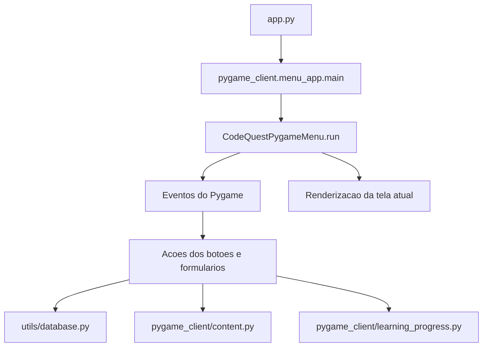

# Arquitetura Interna do CodeQuest

Este documento descreve como o CodeQuest esta organizado na versao Pygame, quais modulos conversam entre si e onde mexer para evoluir o jogo.

## Visao Geral

O ponto de entrada e `app.py`. Ele chama `pygame_client.menu_app.main()`, que inicializa o Pygame, cria a classe `CodeQuestPygameMenu` e entra no loop principal do jogo.



## Camadas do Projeto

### `pygame_client/`

Contem a interface jogavel:

- `menu_app.py`: orquestra telas, eventos, estado de navegacao, aulas, exercicios, perfil e creditos.
- `ui.py`: componentes reutilizaveis de interface, como `Button`, quebra de texto e texto centralizado.
- `content.py`: adapta os JSONs de aula e exercicios para o Pygame, corrigindo textos quando necessario.
- `learning_progress.py`: valida respostas, calcula XP potencial e registra conclusao de exercicios.
- `audio.py`: inicializa trilha e efeitos sonoros gerados em tempo de execucao.
- `credits.py`: define o conteudo estruturado da tela de creditos.
- `palette.py` e `settings.py`: concentram cores, tamanhos, FPS e caminhos visuais.

### `backend/`

Contem regras de dominio independentes da tela:

- `usuario.py`: dataclass `Usuario`, criacao, carregamento a partir de dicionario e soma de XP.
- `xp_system.py`: regras de nivel, XP para proximo nivel e persistencia apos ganhar XP.
- `exercicio.py`: leitura bruta dos arquivos `data/aulas.json` e `data/exercicios.json`.

### `utils/`

Contem persistencia SQLite:

- `database.py`: fachada publica usada pelo resto do projeto.
- `database_config.py`: caminhos, constantes e ID do usuario ativo.
- `database_connection.py`: conexao e criacao de tabelas.
- `user_repository.py`: CRUD do usuario ativo e migracao do JSON legado.
- `user_mapper.py`: conversao entre linhas SQLite, dicionarios e `Usuario`.
- `exercise_progress_repository.py`: erros por exercicio e bloqueio de XP duplicado.

### `data/`

Guarda conteudo e assets versionados:

- `aulas.json`: textos e trilhas pedagogicas.
- `exercicios.json`: perguntas, alternativas, respostas e respostas aceitas.
- fontes, imagens, cutscenes e frames animados.

O save local fica em `data/codequest.db`, gerado em execucao e ignorado pelo Git.

## Fluxo de Telas

O atributo `screen_name` em `CodeQuestPygameMenu` decide qual tela e renderizada.

Fluxo principal:

1. `start`: menu inicial com novo jogo, continuar, creditos e sair.
2. `create`: criacao do personagem quando um novo save e necessario.
3. `hub`: menu principal apos existir usuario.
4. `worlds`: selecao do Arquipelago de Bythos.
5. `learning`: aula e exercicios em sequencia.
6. `profile`: visualizacao de nome, idade, XP e nivel.
7. `credits`: creditos do projeto.
8. `complete`: encerramento temporario do conteudo disponivel.

## Novo Jogo e Continuar

`_novo_jogo()` limpa o banco com `resetar_banco_de_dados()` e leva para a tela de criacao de personagem.

`_continuar()` tenta carregar o usuario ativo com `carregar_usuario()`. Se houver usuario, segue para o `hub`; se nao houver, exibe uma mensagem pedindo criacao de personagem.

`_criar_usuario()` valida nome e idade, chama `criar_usuario()` e avanca para o `hub`.

## Fluxo de Aula e Exercicios

O Mundo 1 comeca em `_iniciar_mundo_1()`. A funcao carrega a aula com `carregar_aula_pygame("mundo_1", "aula_1")` e os exercicios com `carregar_exercicios_pygame("mundo_1")`.

A trilha pedagogica e lida em blocos. Cada bloco pode ser:

- `aula`: renderiza um trecho de explicacao.
- `exercicios`: mostra um exercicio por vez.

O fluxo planejado e:

```text
texto da aula -> 5 exercicios -> texto da aula -> 5 exercicios -> texto da aula -> 5 exercicios
```

Quando o jogador responde, `_responder_exercicio()` chama `registrar_resposta()`.

## Regras de XP

Cada exercicio comeca valendo 10 XP. A cada erro, o XP potencial cai 2 pontos:

```text
0 erros: 10 XP
1 erro: 8 XP
2 erros: 6 XP
3 erros: 4 XP
4 ou mais erros: 2 XP
```

Depois que um exercicio foi concluido, ele continua podendo ser respondido, mas nao concede XP de novo. Esse bloqueio vem da tabela `exercicios_concluidos`.

## SQLite

As tabelas sao criadas por `inicializar_banco()`:

- `usuarios`: save do jogador ativo.
- `exercicios_concluidos`: exercicios que ja deram XP.
- `exercicio_erros`: contador de erros por usuario, mundo e exercicio.

O repositorio usa `INSERT ... ON CONFLICT` para atualizar o usuario ativo sem duplicar registros.

## Pontos de Extensao

Para adicionar uma nova aula:

1. Inclua os textos em `data/aulas.json`.
2. Inclua os exercicios em `data/exercicios.json`.
3. Atualize o fluxo em `menu_app.py` para iniciar o novo mundo ou aula.
4. Adicione testes cobrindo carregamento de conteudo e regras novas.

Para alterar regras de XP, mexa em `pygame_client/learning_progress.py` e, se necessario, em `backend/xp_system.py`.

Para mudar o visual, prefira `pygame_client/palette.py`, `pygame_client/settings.py` e componentes de `pygame_client/ui.py`.
