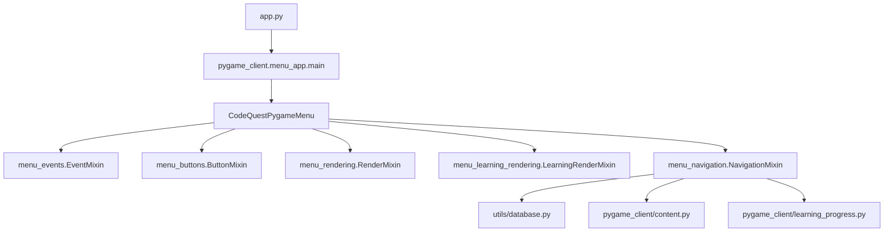

# Arquitetura Interna do CodeQuest

Este documento descreve a organização interna do CodeQuest na versão 1.5, com foco no fluxo Pygame, persistência SQLite e separação do menu em módulos menores.

## Visão Geral

`app.py` é o ponto de entrada. Ele chama `pygame_client.menu_app.main()`, que cria `CodeQuestPygameMenu` e inicia o loop principal. A classe principal ficou responsável por inicializar Pygame, fontes, imagens, áudio e estado compartilhado; comportamento de tela foi separado em mixins.



## Camadas

### `pygame_client/`

- `menu_app.py`: inicializa Pygame, carrega assets, cria fontes, mantém estado compartilhado e executa o loop principal.
- `menu_buttons.py`: monta botões por tela.
- `menu_events.py`: processa teclado, mouse, campos de texto e links externos.
- `menu_navigation.py`: controla transições de tela, criação de usuário, início de mundos, respostas e conclusão de aulas.
- `menu_rendering.py`: desenha telas gerais, como início, hub, mundos, perfil, cutscene e créditos.
- `menu_learning_rendering.py`: desenha aulas, exercícios e tela de conclusão.
- `menu_config.py`: concentra constantes do menu, lista de mundos, cores locais e textos da cutscene.
- `audio.py`: controla trilhas MP3 por contexto e efeitos de interface.
- `content.py`: lê e normaliza conteúdo pedagógico vindo dos JSONs.
- `learning_progress.py`: valida respostas, calcula XP potencial e registra progresso.
- `ui.py`: contém `Button`, quebra de texto e helpers de desenho.
- `palette.py` e `settings.py`: centralizam cores, janela, FPS e título.

### `backend/`

- `usuario.py`: dataclass `Usuario` e operações de domínio do usuário.
- `xp_system.py`: cálculo de nível, XP para próximo nível e soma de XP.
- `exercicio.py`: leitura bruta dos arquivos de aula e exercício.

### `utils/`

- `database.py`: fachada pública de persistência.
- `database_connection.py`: conexão SQLite e criação de tabelas.
- `database_config.py`: caminhos e constantes do banco.
- `user_repository.py`: CRUD do usuário ativo e migração de JSON legado.
- `user_mapper.py`: conversão entre SQLite, dicionários e dataclass `Usuario`.
- `exercise_progress_repository.py`: progresso de exercícios, erros e bloqueio de recompensa duplicada.

### `data/`

Contém conteúdo e assets versionados:

- `aulas.json` e `exercicios.json`.
- fontes: PressStart2P, RammettoOne e WendyOne.
- frames de fundo, imagens de cutscene, fundos de mundo e músicas.

O save local `data/codequest.db` é gerado em execução e ignorado pelo Git.

## Fluxo de Telas

O atributo `screen_name` define a tela ativa:

- `start`: menu inicial.
- `create`: criação de personagem.
- `hub`: menu de jornada.
- `cutscene`: narrativa inicial.
- `worlds`: Arquipélago de Bythos.
- `lesson`: aula ou exercício.
- `profile`: perfil do jogador.
- `credits`: créditos.
- `complete`: conclusão do mundo ativo.

## Fluxo Pedagógico

Cada aula em `data/aulas.json` possui uma `trilha`, composta por segmentos:

- `aula`: texto explicativo, com suporte opcional a link externo.
- `exercicios`: lista de IDs carregados de `data/exercicios.json`.

O Mundo 1 segue o formato:

```text
texto -> 5 exercícios -> texto -> 5 exercícios -> texto -> 5 exercícios
```

O Mundo 2 usa o mesmo padrão visual e começa com blocos menores de texto e prática.

## Progresso e Bloqueios

Quando um exercício é concluído, o registro é salvo em `exercicios_concluidos`. Ao reiniciar o app, `NavigationMixin._pular_exercicios_concluidos()` ignora exercícios já feitos, mas preserva os textos de aula para revisão.

O Mundo 2 só abre quando os 15 exercícios do Mundo 1 constam como concluídos no banco.

## Regras de XP

Cada exercício começa valendo 10 XP. A cada erro, o ganho potencial cai 2 pontos, até o mínimo de 2 XP.

```text
0 erros: 10 XP
1 erro: 8 XP
2 erros: 6 XP
3 erros: 4 XP
4 ou mais erros: 2 XP
```

Exercícios já concluídos não concedem XP novamente.

## Áudio

`AudioController` mapeia contexto de tela para música:

- `start`: Tela Inicial.
- `hub`: Menu de Jornada.
- `cutscene`: Cutscene.
- `worlds`: Arquipélago.
- `lesson`: Aula.
- `exercise`: Exercícios.
- `profile`: Perfil.
- `credits`: Créditos.

Se uma faixa MP3 não puder ser carregada, o controlador usa fallback sintético simples.

## Pontos de Extensão

Para adicionar um novo mundo:

1. Adicione textos em `data/aulas.json`.
2. Adicione exercícios em `data/exercicios.json`.
3. Inclua o mundo em `MUNDOS_BYTHOS`, em `pygame_client/menu_config.py`.
4. Crie uma ação de início em `menu_navigation.py` caso o mundo tenha regras próprias de bloqueio.
5. Adicione testes de carregamento de conteúdo e fluxo.

Para mudar visual:

1. Prefira `palette.py`, `settings.py`, `ui.py` e os módulos de renderização.
2. Mantenha fontes padronizadas: PressStart2P para títulos, RammettoOne para subtítulos e WendyOne para corpo.

Para mudar persistência:

1. Ajuste os repositórios em `utils/`.
2. Exponha a função pela fachada `utils/database.py` quando outras camadas precisarem usar.
