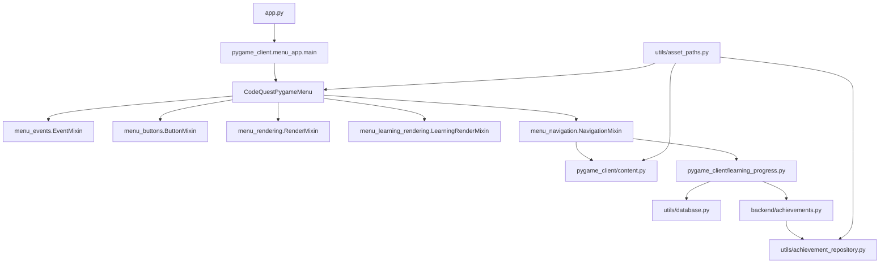

# Arquitetura Interna do CodeQuest

Este documento descreve a organizacao interna do CodeQuest na versao 2.0, com foco no fluxo Pygame, persistencia SQLite, conteudo em JSON e assets reorganizados.

## Visao Geral

`app.py` e o ponto de entrada. Ele chama `pygame_client.menu_app.main()`, que instancia `CodeQuestPygameMenu` e inicia o loop principal. A classe principal inicializa Pygame, fontes, imagens, audio e estado compartilhado. O comportamento de tela fica separado em mixins.



## Camadas

### `pygame_client/`

- `menu_app.py`: inicializa Pygame, carrega assets, cria fontes, mantem estado compartilhado e executa o loop principal.
- `menu_buttons.py`: monta botoes por tela.
- `menu_events.py`: processa teclado, mouse, campos de texto e links externos.
- `menu_navigation.py`: controla transicoes de tela, criacao de usuario, inicio de mundos, respostas e conclusao de aulas.
- `menu_rendering.py`: desenha telas gerais, como inicio, hub, mundos, perfil, cutscene e creditos.
- `menu_learning_rendering.py`: desenha aulas, exercicios, cutscene final, textos finais e conclusao.
- `menu_config.py`: concentra constantes visuais e textos da cutscene inicial.
- `audio.py`: controla trilhas MP3 por contexto e efeitos de interface.
- `content.py`: le e normaliza conteudo pedagogico vindo dos JSONs.
- `learning_progress.py`: valida respostas, calcula XP potencial e registra progresso.
- `ui.py`: contem `Button`, quebra de texto e helpers de desenho.
- `palette.py` e `settings.py`: centralizam cores, janela, FPS e titulo.

### `backend/`

- `usuario.py`: dataclass `Usuario` e operacoes de dominio do usuario.
- `achievements.py`: regras de desbloqueio de conquistas e calculos de XP maximo/minimo disponivel.
- `xp_system.py`: calculo de nivel, XP para proximo nivel e soma de XP.
- `exercicio.py`: leitura dos arquivos de aula e exercicio em `data/content/`.
- `worlds.py`: leitura de `data/content/mundos.json` e helpers para metadados de progressao.

### `utils/`

- `asset_paths.py`: caminhos centralizados para conteudo e assets versionados.
- `database.py`: fachada publica de persistencia.
- `database_connection.py`: conexao SQLite e criacao de tabelas.
- `database_config.py`: caminhos e constantes do banco local.
- `user_repository.py`: CRUD do usuario ativo e migracao de JSON legado.
- `user_mapper.py`: conversao entre SQLite, dicionarios e dataclass `Usuario`.
- `exercise_progress_repository.py`: progresso de exercicios, erros e bloqueio de recompensa duplicada.
- `world_progress_repository.py`: progresso por mundo, conclusao e desbloqueio.
- `achievement_repository.py`: leitura de `data/content/conquistas.json`, desbloqueio idempotente e listagem para o perfil.

## Pasta `data/`

`data/` separa conteudo versionado, assets e runtime local:

```text
data/
|-- audio/music/              # trilhas MP3
|-- content/                  # JSONs de aulas, exercicios, mundos e conquistas
|-- fonts/                    # PressStart2P, RammettoOne e WendyOne
|-- images/
|   |-- achievements/         # icones de conquistas
|   |-- backgrounds/          # fundos de mundos e cutscenes
|   `-- cutscenes/            # imagens da cutscene inicial
`-- video/
    |-- credits/
    |-- hub/
    |-- mundo_9_cutscene/
    |-- profile/
    |-- start/
    `-- worlds/
```

O save local `data/codequest.db` e gerado em execucao e ignorado pelo Git. Logs e caches tambem ficam fora do versionamento.

## Fluxo de Telas

O atributo `screen_name` define a tela ativa:

- `start`: menu inicial.
- `create`: criacao de personagem.
- `hub`: menu de jornada.
- `cutscene`: narrativa inicial.
- `worlds`: Arquipelago de Bythos.
- `lesson`: aula, exercicio, cutscene final ou texto final.
- `profile`: perfil do jogador.
- `credits`: creditos.
- `complete`: conclusao do mundo ativo.

## Fluxo Pedagogico

Os metadados de progressao ficam centralizados em `data/content/mundos.json`. Cada mundo define ID, rotulo, nome exibido, requisito de desbloqueio, aula inicial, implementacao, exercicios obrigatorios e assets opcionais de fundo.

Cada aula em `data/content/aulas.json` possui uma `trilha`, composta por segmentos:

- `aula`: texto explicativo, com suporte opcional a link externo.
- `exercicios`: lista de IDs carregados de `data/content/exercicios.json`.
- `cutscene_video`: frames e audio usados no encerramento do Mundo 9.
- `final_text`: telas narrativas finais e agradecimentos.

Os mundos 1 a 8 combinam blocos de texto e pratica. O Mundo 9 tem uma aula de recursividade, cutscene final, texto de encerramento e agradecimentos.

## Progresso e Bloqueios

Quando um exercicio e concluido, o registro e salvo em `exercicios_concluidos`. Em seguida, `verificar_e_marcar_conclusao_mundo()` confere se todos os exercicios obrigatorios daquele mundo foram concluidos e grava a conclusao em `mundos_concluidos`.

Ao reiniciar o app, `NavigationMixin._pular_exercicios_concluidos()` ignora exercicios ja feitos, mas preserva os textos de aula para revisao.

O desbloqueio de novos mundos consulta a camada de progresso por mundo e a configuracao central em `data/content/mundos.json`. O Mundo 9 exige apenas a conclusao do Mundo 1.

## Regras de XP

Cada exercicio comeca valendo 10 XP. A cada erro, o ganho potencial cai 2 pontos ate o minimo de 2 XP.

```text
0 erros: 10 XP
1 erro: 8 XP
2 erros: 6 XP
3 erros: 4 XP
4 ou mais erros: 2 XP
```

Exercicios ja concluidos nao concedem XP novamente.

O nivel do jogador vai de 1 a 5, alinhado ao teto atual de 1200 XP:

- 100 XP: nivel 1
- 200 XP: nivel 2
- 300 XP: nivel 3
- 600 XP: nivel 4
- 1200 XP: nivel 5

## Conquistas

As conquistas sao configuradas em `data/content/conquistas.json`. Cada entrada define `id`, `nome`, `dica`, descricao, imagem desbloqueada, imagem bloqueada e se a conquista e secreta.

A persistencia fica em `usuario_conquistas`, com chave primaria `(usuario_id, conquista_id)` para impedir duplicidade. `desbloquear_conquista()` usa escrita idempotente e retorna sucesso apenas quando a conquista foi gravada pela primeira vez, alimentando a notificacao temporaria.

Regras atuais:

- `melhor_professor_ufal`: avaliada na criacao do usuario.
- `fenomeno`: avaliada apos ganho de XP; exige XP maximo disponivel.
- `quase_hexa`: avaliada apos conclusao de exercicio; exige todo conteudo implementado concluido com XP minimo.

## Audio

`AudioController` mapeia contexto de tela para musica:

- `start`: tela inicial.
- `hub`: menu de jornada.
- `cutscene`: cutscene inicial.
- `worlds`: Arquipelago.
- `lesson`: aula.
- `exercise`: exercicios.
- `profile`: perfil.
- `credits`: creditos.
- `complete`: conclusao.

Se uma faixa MP3 nao puder ser carregada, o controlador usa uma trilha procedural simples como fallback.

## Pontos de Extensao

Para adicionar um mundo:

1. Adicione textos em `data/content/aulas.json`.
2. Adicione exercicios em `data/content/exercicios.json`.
3. Inclua metadados em `data/content/mundos.json`.
4. Defina `requer`, `implementado`, `aula_inicial`, `background`, `overlay_alpha` e `exercicios_obrigatorios`.
5. Adicione testes de conteudo e fluxo.

Para mudar assets:

1. Coloque JSONs em `data/content/`.
2. Coloque fontes em `data/fonts/`.
3. Coloque imagens em `data/images/`.
4. Coloque frames de video em `data/video/`.
5. Atualize `utils/asset_paths.py` se criar uma categoria nova.

Para mudar persistencia:

1. Ajuste os repositorios em `utils/`.
2. Exponha a funcao pela fachada `utils/database.py` quando outra camada precisar usar.
3. Mantenha regras de progresso fora do Pygame; o cliente deve consultar funcoes de dominio/repositorio.

Para adicionar uma conquista:

1. Adicione a entrada em `data/content/conquistas.json`.
2. Coloque os PNGs em `data/images/achievements/`.
3. Implemente a regra em `backend/achievements.py`.
4. Use `utils/achievement_repository.py` para persistir o desbloqueio.
5. Adicione testes em `tests/test_achievements.py`.
